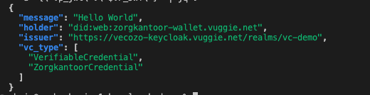
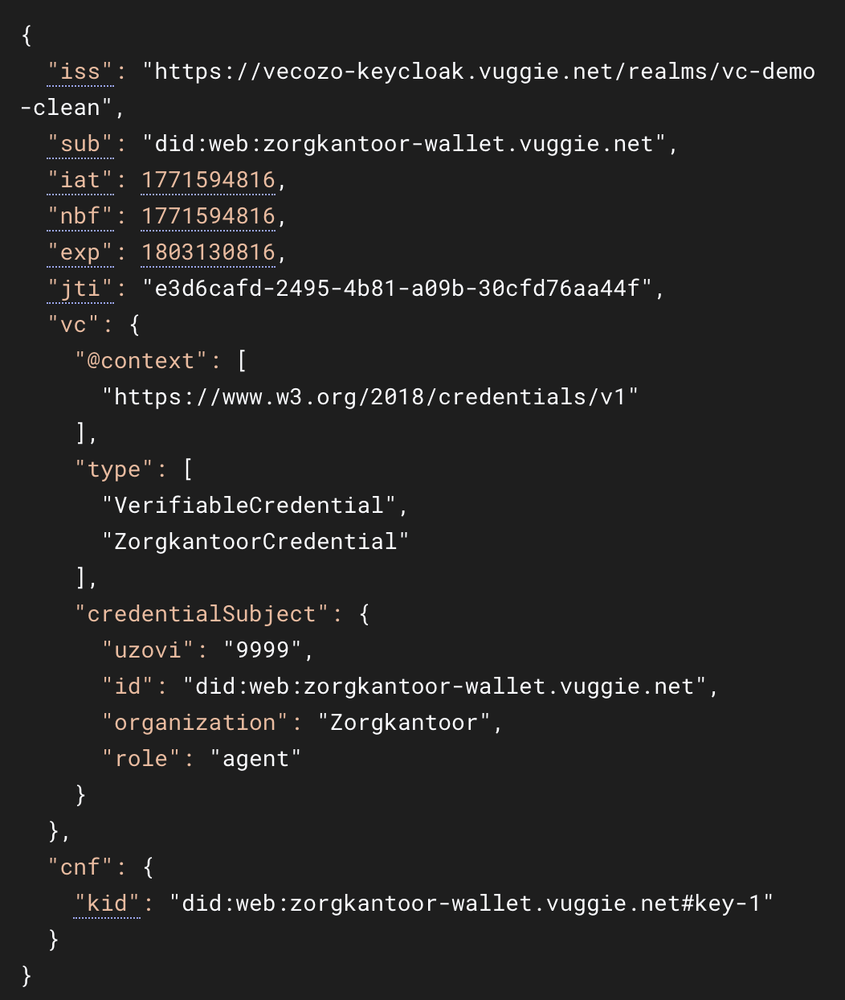

# VC Demo, pre authorized code flow

This repo contains a demo that uses Keycloak as Identity provider according to the [Pre-Authorized Code Flow](https://openid.net/specs/openid-4-verifiable-credential-issuance-1_0.html) OID4VC specification.
This is the technical material that will be used in the February hackathon with Zorginstituut Nederland and Vecozo.

In this demo we emulate a simple flow:

- Zorgkantoor (Wallet) calls CIZ (Verifier) with a VC that has been Issued by Vecozo (Issuer)

This Verifiable Credential demo aligns with European and Dutch healthcare regulatory ambitions by implementing decentralized, cryptographically verifiable identity and authorization mechanisms consistent with the eIDAS 2.0 framework, the European Digital Identity Wallet, and Dutch national initiatives such as the Landelijk Vertrouwenstelsel, NEN 7510, and the MedMij and Nuts trust frameworks, enabling secure, privacy-preserving, and interoperable exchange of healthcare identity and authorization attributes under the principles of data minimization, strong authentication, and verifiable trust.

Please note that the issuer service is made for DEMO purposes to show the concept of a VC Issuance. In a production environment an enterprise grade PKI infrastructure will take care of the keys and signing.

[Here](https://youtu.be/5TsiyJSpB7g) is an animation to show the flow of this demo.

```mermaid
sequenceDiagram
  autonumber

  participant VO as Vecozo Offer Service
  participant AS as Keycloak Authorization Server
  participant IS as Vecozo Issuer Service
  participant W as Zorgkantoor Wallet
  participant VCStore as Wallet VC Store
  participant V as CIZ Verifier

  Note over VO,AS: 1. Vecozo initieert issuance en maakt credential offer
  VO->>AS: client_credentials grant
  AS-->>VO: OFFER_TOKEN

  VO->>AS: Create credential offer
  AS-->>VO: credential_offer_uri

  Note over VO,W: 2. Vecozo levert offer aan wallet
  VO-->>W: credential_offer_uri link

  Note over W,AS: 3. Wallet haalt offer op en redeem pre-authorized_code
  W->>AS: GET credential_offer_uri
  AS-->>W: credential_offer with pre-authorized_code

  W->>AS: POST /token with pre-authorized_code
  AS-->>W: ACCESS_TOKEN

  Note over W,IS: 4. Wallet vraagt nonce en maakt proof
  W->>IS: POST /credential (no proof)
  IS-->>W: invalid_proof + c_nonce

  W->>W: Create proof_jwt and sign with holder key

  Note over W,IS: 5. Wallet vraagt credential
  W->>IS: POST /credential with proof_jwt
  IS-->>W: VC signed by issuer

  Note over W,VCStore: 6. Wallet slaat VC op
  W->>VCStore: Store VC
  VCStore-->>W: OK

  Note over W,V: 7. Wallet presenteert VC aan verifier
  W->>VCStore: GET latest VC
  VCStore-->>W: VC

  W->>W: Create VP_JWT and sign with holder key

  W->>V: POST VP_JWT
  V->>V: Verify VP and VC signatures
  V-->>W: Allow or Deny
  ```


# Pre Requisites

- This Demo is based on Keycloak version `26.5.3`

## Configure Realm

- Create a new REALM in keycloak (for e.g. vc-demo)
- This realm will act as:
  1. Authorization Server (OFFER_TOKEN via client_credentials)
  1. Credential Offer Service (OFFER_HANDLE / offer URI)
  1. Authorization Server (wallet: pre-authorized_code → ACCESS_TOKEN)
  1. Credential Issuer (credential endpoint produces VC payload)
  1. Credential Signing Authority (signs VC)
- In Realm settings enable `Verifiable Credentials`
- Configure a OID4VC scope; this is not supported by the UI yet; just execute the `./createScope.sh` script; this will create a client scope named: `membership-credential`
- Configure Identity Attribute, Adde `uzovi`; in Realm settings, User Profile , add Attribute `uzovi`
- In the UI, after creating the `membership-credential` go to client scopes, select `membership-credential` and add a mapper. Configure new mapper (User Attribute mapper), name it `uzovi` *Note: this is still very buggy in Keycloak, so we need to create a OIDC scope as well in stead of a OID4VC scope only*
- Client scopes → Create client scope `wallet-token-claims` Protocol: openid-connect
	- Client scopes → wallet-token-claims → Mappers → Create
	- Mapper type: User Attribute, Name: uzovi
  - Maker sure you map the uzovi user attribute to token claim name `vc.credentialSubject.uzovi`
- Assign to wallet client:
	- Clients → zorgkantoor-wallet → Client scopes → Add client scope
	- Select wallet-token-claims, Add as Default

The following identities are initially needed for this demo to work;
- Credential Subject; user `zorgkantoor-agent`
- Wallet; public client `zorgkantoor-wallet`
- Issuer Backend; confidential client `issuer-offer-service`


## Configure Issuer Backend client

- Within your new REALM create a confidential client named `issuer-offer-service`, type OpenID Connect; this is needed to create an initial offer token, it needs the following:
  - Client Authentication On
  - Service Accounts Roles checked (this will create an internal keycloak user service-account-[YOUR CLIENT NAME])
  - Authorize to create offers:
    - In Service Account Role assign a REALM role with the name `credential-offer-create`
    - OIDC4VC enabled, you can find this under "Advanced"
- for this client: No Redirect URLs/ No OIDC standard flow/ No profile mappers/ nothing to do with VC

## Configure User (Identity)

In your realm go to User and create `zorgkantoor-agent`
Keep everything default, and fill in a `uzovi` identifier for eg 9999

## Configure Wallet client (Credential holder)

- Create client `zorgkantoor-wallet`, type OpenID Connect; This client will receive the credential offer form the `issuer-offer-service` and will exchange the `pre-authorized-code` for an actual `access token`. This access token will be used later by the Issuer service (the service that actually creates the VC). Please note that client works with the `pre-authorized-code` which is an internal Keycloak authorization credential
- Set client as a public client
  - Client authentication: OFF (public client)
  -	Standard flow: OFF
  -	Direct access grants: OFF
  -	Implicit flow: OFF
  -	Service accounts: OFF
- OIDC4VC enabled, you can find this under "Advanced"
- Client scope; assign `membership-credential`credential default (this is the one you created a realm setup phase)

## Create config file

In your folder create a .env file with the following content
```
KC_CONTAINER='keycloak'
KC_URL='http://localhost:8443'
KC_DB_USERNAME='keycloak'
KC_DB_PASSWORD='[ YOUR KC DB PASSWD ]'
KEYCLOAK_ADMIN='admin'
KEYCLOAK_ADMIN_PASSWORD='YOUR KC ADMIN PASSWD'
OFFER_SERVICE_CLIENT_SECRET='YOUR KC OFFER SERVICE CLIENT PASSWD'
REALM='vc-demo'
WALLET_PROOF_EP="https://zorgkantoor-wallet.vuggie.net/make-proof"
```

# Run demo

- Bring up Infrastructure; 
  - `docker compose up -d`
  - Start issuer service (creates VC); cd issuer-service; ./start.sh 

- create VC
  - `./createVC.sh`

This emulates all the steps that are done by the Issuer/ Vecozo (create Offer) and the Wallet/ Zorgkantoor in order to create and store an issued and signed VC in a Wallet.

- get latest VC from Wallet

```
VC_JWT=$(curl -sS http://localhost:3000/credentials/latest | jq -r .credential)
echo "VC_JWT_LEN=${#VC_JWT}"
```

- Make VP (needed when calling the Verifier)

```
VP_JWT=$(curl -sS -X POST http://localhost:3000/make-vp \
  -H "Content-Type: application/json" \
  -d '{"verifier_aud":"ciz-verifier"}' | jq -r .vp_jwt)
```

- Call the Verifier (CIZ)

```
curl -sS -X POST "http://localhost:8002/hello" \
  -H "Content-Type: application/json" \
  -d "{\"vp_jwt\":\"$VP_JWT\"}" | jq .
```

This should return something like this:


Based on this demo your VC will look something like this: 

